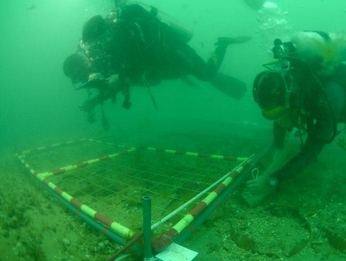
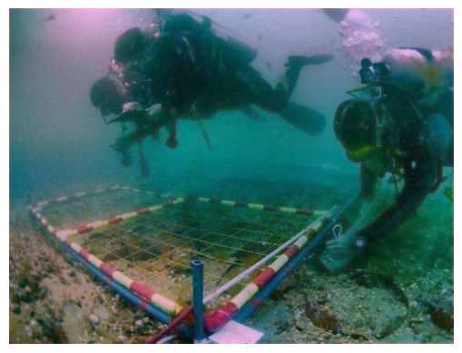

# Underwater Image Enhancement

## Introduction
Underwater images often suffer from poor visibility and color distortion due to light absorption and scattering by water. These issues make it challenging to analyze underwater scenes accurately, whether for marine research, exploration, or photography. One of the primariy concerns has been the absence of red color in the images. This project focuses on enhancing the quality of underwater images by addressing common problems such as low contrast, color imbalance, and blurriness, using advanced image processing techniques.

The project is a python implementation of the paper **"Single underwater image enhancement based on differential attenuation compensation"**. The paper can be found [here](https://www.frontiersin.org/journals/marine-science/articles/10.3389/fmars.2022.1047053/full). 

You can also find the dataset (UIEB) that was used for this project [here](https://www.kaggle.com/datasets/larjeck/uieb-dataset-raw).


## Why Underwater Image Enhancement?
Underwater environments are unique and often hold valuable information about marine ecosystems, submerged archaeological sites, and more. However, the degraded quality of underwater images limits their usability. Enhancing these images improves:
- **Clarity:** Making features like coral reefs, aquatic life, or underwater structures more discernible.
- **Color Accuracy:** Restoring natural colors (especially red) for better visual analysis and aesthetic appeal.
- **Data Reliability:** Enhancing features for scientific studies and machine learning applications.

This project aims to tackle these challenges and provide an efficient and adaptable solution for underwater image enhancement.

## Pipeline Overview

1. Underwater images suffer from low contrast due to scattering and non-uniform lighting. Deep-sea artificial lighting further introduces uneven brightness levels. The first step is to enhance the contrast of the image to improve visibility. This is achieved using a contrast enhancement algorithm. The algorithm used here is the **CLAHE** (Contrast Limited Adaptive Histogram Equalization) algorithm.

2. The second step is to address the color imbalance in underwater images. Water absorbs and scatters light, leading to color distortion. The red channel is particularly affected, resulting in a bluish or greenish tint in underwater images. To correct this, a color correction algorithm is applied to restore the natural colors of the scene. The algorithm used here is the **R channel attenuation compensation**.

3. Finally we apply the **Gray World Algorithm** to correct the color balance of the image. The Gray World Algorithm assumes that the average color of the image is gray and uses this assumption to correct the color balance of the image.


## Project Structure
Below is an overview of the files in this repository and their roles:

### Files and Their Functions
1. **`enhancement.py`**
   - Contains the core image enhancement algorithm.
   - Includes methods for contrast adjustment, attenuation and color correction
   - Parameters like kernel size, sigma, and others can be customized to fine-tune the results.

2. **`multi_image_enhancement.py`**
   - The entry point for the project.
   - Processes all images in a specified folder (`input_imgs`) and saves enhanced versions to `output_imgs`.
   - Uses the `enhancement` module to apply enhancement techniques to each image.

3. **`single_image_enhancement.py`**
    - Contains a standalone script for enhancing a single image.
    - Users can specify the input and output image paths, as well as custom parameters for the enhancement algorithm.


4. **`input_imgs/`**
   - Directory where the user places images to be enhanced.
   - Ensure images are in png format.
   - The images are not uploaded to the repository due to size constraints.

5. **`output_imgs/`**
   - Directory where the enhanced images are saved.
   - The enhanced images retain the same filenames as their input counterparts.

6. **`README.md`**
   - This documentation file.

Feel free to explore other files in the repository for more details on the implementation and customization options.

### An example of the enhanced images is as shown

| Original Image | Enhanced Image |
|----------------|----------------|
|  |  |

### How to Use the Project
1. Clone this repository:
   ```bash
   git clone https://github.com/Yash1038/underwater-image-enhancement.git
   cd underwater-image-enhancement
   ```
2. Place your underwater images in the `input_imgs/` directory.
3. Run the project:
   ```bash
   python multi_image_enhancement.py
   ```
4. Enhanced images will be saved in the `output_imgs/` directory.

## Contributors
- **Yashaswi Pasumarthy, Aditya Ranjan Padhi**
  - Contributions: Implemented the enhancement algorithms, structured the project, and documented usage.

If you'd like to contribute to this project, feel free to open issues or submit pull requests. Feedback and suggestions are always welcome!
